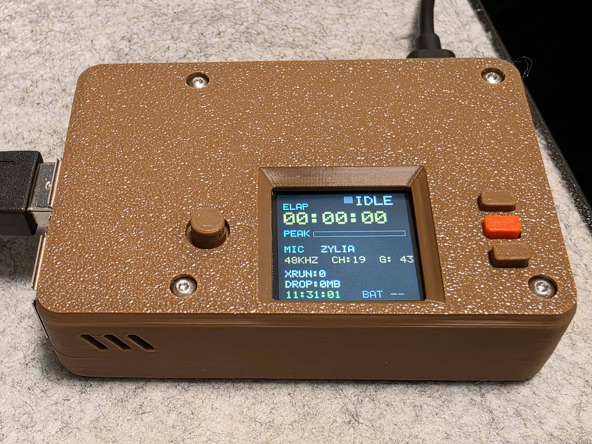
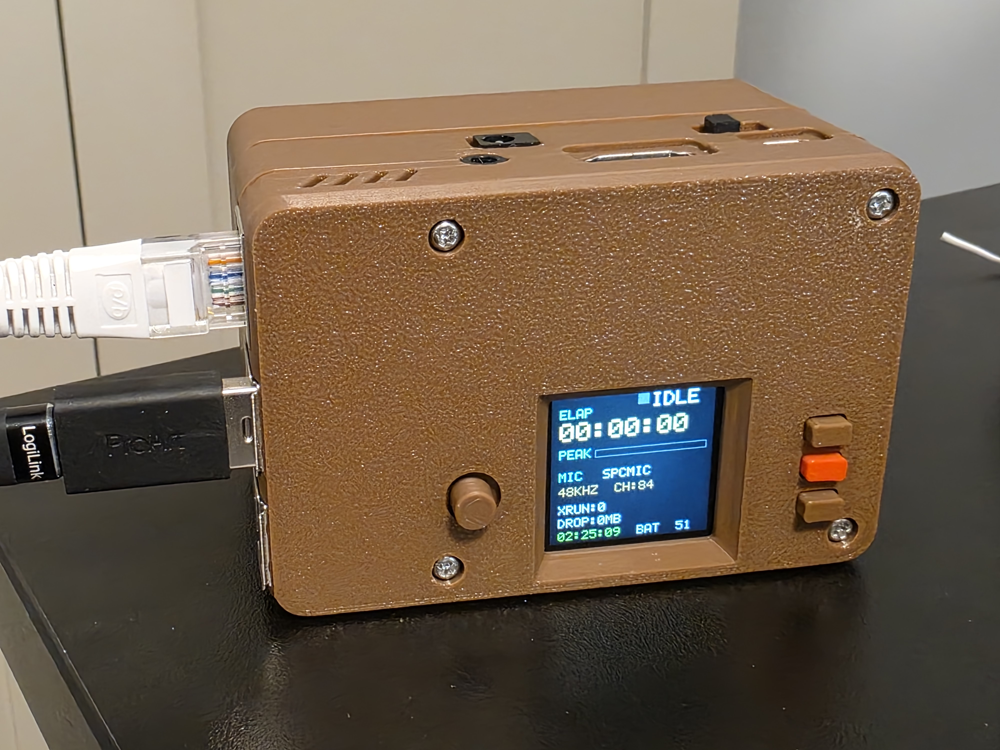

# rpi_multirec

`rpi_multirec` is a Raspberry Pi based multichannel field recorder for large-array USB microphones. The current software is focused on two microphones:

- `spcmic` (84-channel capture)
- `Zylia ZM-1` (19-channel capture)

The recorder writes RF64 files so long takes are not limited by classic WAV size constraints. It is designed to run headless on a Raspberry Pi with a small Waveshare LCD HAT for status display and basic transport control.

This repository is a work in progress and intended to grow into an open software + open hardware recorder project. The software is already usable; the hardware and enclosure documentation will be expanded further.

## Current software capabilities

- Multichannel ALSA capture in C++
- RF64 writing via `libsndfile`
- `48 kHz` and `96 kHz` support where the selected microphone supports it
- Presets for `spcmic` and `zylia`
- Automatic take naming
- Support for multiple takes in one session
- Ring-buffered writer thread with XRUN and dropped-byte reporting
- Optional Waveshare `1.3inch LCD HAT` UI
- On-device file browser and stereo review playback on the LCD HAT
- Battery readout support for Waveshare `UPS HAT (B)`
- Automatic use of mounted exFAT external storage when present at app startup
- Samba/Avahi workflow for retrieving files over the network
- Headless boot via `systemd`

## Project status

This is still an actively developed recorder prototype. The core recording workflow is working, and the project should be treated as a build-it-yourself system rather than a finished consumer product.

## Hardware overview

This section is a first draft. Obvious major parts are listed here; additional part names and exact BOM details can be added later.

### Core parts

- Raspberry Pi 3 Model B+ (tested)
- Other Raspberry Pi models may work, but are not yet documented as supported
- MicroSD card for the OS
- Power source suitable for stable multichannel USB recording (if not using the UPS module)
- USB microphone arrays (they can be plugged in simultaneously and are user selectable, but only one can be recorded at a time):
  - `spcmic` with latest firmware (USB Audio Class Compliant mode) - https://spcmic.com/
  - and/or `Zylia ZM-1` - https://www.zylia.co/zylia-zm-1-microphone.html
- Storage target:
  - internal SD card (same as OS), large capactiy and fast (UHS-I A1 U3 V30 C10)
  - or external USB storage (exFAT supported in current workflow)
- Waveshare `1.3inch LCD HAT` - https://www.waveshare.com/1.3inch-lcd-hat.htm
- Waveshare `UPS HAT (B)` - https://www.waveshare.com/ups-hat-b.htm

### Example builds

Compact version without the battery module. This version is smaller, but it needs external power such as a USB power bank:



Version with the battery module installed. This version is bulkier, but it is self-contained:



### Enclosure / 3D printing

The `STL/` folder contains enclosure parts that can be 3D printed for the recorder build:

- `STL/RPi_RecorderButtons.stl`
- `STL/RPi_RecorderCaseBottomBattery.stl`
- `STL/RPi_RecorderCaseBottomNoBattery.stl`
- `STL/RPi_RecorderCaseBottomSideInsertBattery.stl`
- `STL/RPi_RecorderCaseTop.stl`
- `STL/RPi_RecorderLCDSupportL.stl`
- `STL/RPi_RecorderLCDSupportS.stl`

A later revision of this README should document which printed parts correspond to which hardware configuration and describe the assembly process. The LCD supports are for the side of the LCD module that is overhanging.

## Software dependencies

Target platform: Raspberry Pi OS Lite on Raspberry Pi 3 Model B+ (tested).

Build dependencies:

```bash
sudo apt update
sudo apt install -y build-essential cmake pkg-config libasound2-dev libsndfile1-dev libgpiod-dev
```

## Build

```bash
cmake -S . -B build
cmake --build build -j
```

Binary output:

```bash
./build/rpi_multirec
```

## Basic usage

### List ALSA capture devices

```bash
./build/rpi_multirec --list-devices
```

### Record with an explicit ALSA device

```bash
./build/rpi_multirec --device hw:1,0 --rate 48000 --out capture.rf64
```

### Record with a microphone preset

```bash
./build/rpi_multirec --mic spcmic
./build/rpi_multirec --mic zylia
```

If `--out` is omitted and a mic preset is selected, the app auto-generates a filename using this format:

```text
<recordings-root>/<prefix>_YYYYMMDD_HHMMSS.rf64
```

Examples:

- `/srv/rpi_multirec/recordings/spc_20260222_143015.rf64`
- `/srv/rpi_multirec/recordings/zyl_20260222_143045.rf64`

### Common options

- `--device <name>` ALSA device
- `--out <path>` output RF64 file
- `--rate 48000|96000`
- `--channels <n>`
- `--mic spcmic|zylia`
- `--format s16|s24`
- `--access rw|mmap`
- `--start auto|explicit`
- `--stdin-raw`
- `--hat-ui`
- `--buffer-ms <ms>`
- `--period-ms <ms>`
- `--ring-ms <ms>`
- `--status-ms <ms>`
- `--list-devices`

Use `--help` for the full current option list.

## Microphone presets

### `spcmic`

Current preset behavior:

- auto-detects a matching `spacemic` ALSA device
- defaults to `84` channels
- defaults to `RW` access
- supports `48 kHz` / `96 kHz` selection in the current app flow

### `zylia`

Current preset behavior:

- auto-detects a matching Zylia ALSA device
- defaults to `19` channels
- defaults to `MMAP` access
- forces `48 kHz`
- supports `Master Gain` control when exposed by the driver

Explicit `--device`, `--channels`, and `--access` arguments override preset defaults.

## On-device playback

When the LCD HAT UI is enabled, the recorder also includes a simple on-device playback browser for reviewing takes without copying them off the Pi first.

Current playback behavior:

- browse `.rf64` takes from the active recordings root
- show up to 6 files at a time, scrolling around the current selection
- display selected-file duration while idle in the browser
- display playback position while a file is playing
- output stereo review playback to the Raspberry Pi headphone output
- force the Pi `Headphones` / `PCM` mixer output on and to full volume before playback

Current review channel routing:

- `spcmic`: channel 25 -> left, channel 53 -> right
- `zylia`: channel 5 -> left, channel 8 -> right

Playback gain is separate from recording and is applied in software for review only.

## Recording destinations

Default internal recordings root:

```text
/srv/rpi_multirec/recordings
```

Current storage behavior:

- If no suitable external drive is mounted when the app starts, recording goes to the internal recordings root.
- If an exFAT external drive is already mounted when the app starts, recording is redirected to:

```text
<mountpoint>/rpi_multirec
```

- That folder is created automatically if needed.
- External storage detection currently happens only once, at app startup.
- If `--out` is relative, it is resolved under the active recordings root.
- If `--out` is absolute, that path is used as-is.

## Waveshare LCD HAT UI

When started with `--hat-ui`, the recorder enters an `IDLE` state instead of recording immediately.

Current control mapping:

- `KEY2`: `IDLE -> MON -> REC`, or start playback from the file browser
- `KEY1`: stop monitoring, stop the current take, or stop playback
- `KEY3` short release: toggle LCD backlight
- `KEY3` hold for 5 seconds: request clean shutdown and Pi poweroff
- Joystick `LEFT/RIGHT` in `IDLE`: cycle `spcmic -> zylia -> playback browser`
- Joystick `UP/DOWN` in `IDLE` with `spcmic`: change sample rate
- Joystick `UP/DOWN` with `zylia` in `IDLE` / `MON` / `REC`: adjust Zylia gain
- Joystick `UP/DOWN` in the playback browser: move through recorded files
- Joystick `UP/DOWN` during playback: adjust playback gain

Current UI information includes:

- recorder state (`IDLE`, `MON`, `REC`, `FILES`, `PLAY`)
- elapsed take time during recording
- file duration in the playback browser and playback position while playing
- selected mic
- sample rate / channel count
- peak meter
- XRUN count
- dropped data amount
- battery percentage (with UPS HAT B)
- remaining recording time based on free storage and current byte rate
- external storage indicator
- playback file list, selected-file route label, and playback gain readout

## Stdin raw mode

The app can also act as an RF64 writer for raw PCM piped in from `arecord` or another capture tool.

Example:

```bash
arecord -D hw:CARD=ZM13E,DEV=0 -f S24_3LE -c 19 -r 48000 -t raw | \
  ./build/rpi_multirec --stdin-raw --rate 48000 --channels 19 --format s24 --out /home/pi/zm1.rf64
```

## Boot and headless operation

The recorder can be run at boot with `systemd`. The repository includes deployment templates for that setup under `deploy/systemd/`.

See `INSTALL.md` for the current provisioning path and `DEVNOTES.md` for bring-up details.

## Network file access

The current recommended way to retrieve files without removing storage is Samba over Ethernet or Wi-Fi.

The repository includes Samba deployment templates under `deploy/samba/`.

Access details:

- Windows Explorer: `\\rpirec.local\recordings`
- macOS Finder: `smb://rpirec.local/recordings`
- Fallback if mDNS hostname discovery fails: use the Pi IP address instead of `rpirec.local`
- Username: `recshare`
- Password: blank / empty

See `INSTALL.md` for the supported installation path and `DEVNOTES.md` for additional setup history.

## Zylia driver notes

On Raspberry Pi OS Lite, the intended path is to install the official Zylia driver package from Zylia before using the microphone.

Older DKMS rebuild notes from Ubuntu bring-up are preserved in `DEVNOTES.md` for reference, but they are not part of the normal Raspberry Pi OS Lite installation path.

## Repository layout

- `src/` - recorder source code
- `STL/` - enclosure parts for 3D printing
- `deploy/` - systemd, udev, and Samba deployment templates
- `scripts/` - installation and verification scripts
- `DEVNOTES.md` - development notes and bring-up history

## Known limitations / current caveats

- Capture reliability still depends heavily on storage performance.
- External storage is only detected when the app starts.
- Hardware assembly and BOM details are still incomplete and will need a more polished public release pass.

## License

License and hardware release terms are not defined in this draft yet.

## TODO for README expansion

- add full BOM with exact part names and links
- document Raspberry Pi model(s) used and tested
- document enclosure assembly
- document HAT wiring / stack order
- document the supported installation workflow and tested setup variants
